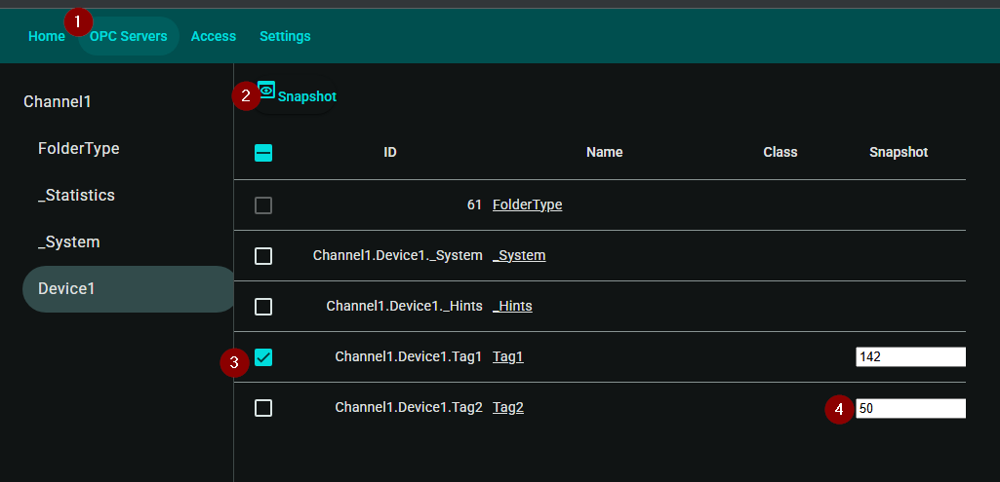

# IotWebsocket

Rest/Websocket Application on top of [open62541.org](https://www.open62541.org/).

## Installation
### Prerequisites
1) [Microsoft Sql Server](https://www.microsoft.com/en-us/sql-server/sql-server-downloads).
2) [nodejs](https://nodejs.org/en/download).

### Steps
1) Execute iot.exe installation.
2) Setup databases, from administrator powershell run:
    ```
    . "$([Environment]::GetFolderPath("CommonDesktopDirectory"))/JdeDBSetup.ps1"
    ```
3) To uninstall, from administrator powershell run:
    ```
    . "$([Environment]::GetFolderPath("CommonDesktopDirectory"))/JdeUninstall.ps1"
    ```
    You will need to manually delete the databases, or uncomment the related lines in JdeUninstall.ps1.

## Running  
1) Click on JdeIotWeb.bat from the desktop.
2) Browse to http://127.0.0.1:8080.
3) Setup Opc Server.  Only anonymous, unsecured connections are supported

   1) Click Settings.
   2) Opc Servers.
   3) Enter Opc Server information.
   4) Click on "Is Default". (bug)
   5) Save.
4) Browsing/Reading/Streaming/Writing.

   1) Click Opc Servers and browse to a node.
   2) Click Snapshot to refresh values.
   3) Click checkbox next to a node to stream values.
   4) Enter new node value to write.
